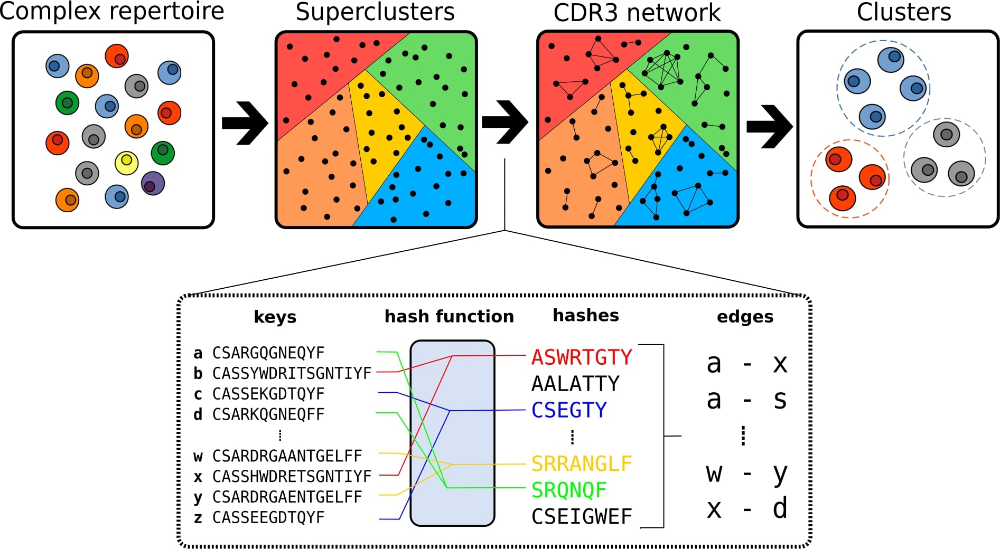

# clusTCR: a Python interface for rapid clustering of large sets of CDR3 sequences [](https://anaconda.org/maxvanhoucke/clustcr) [](https://anaconda.org/maxvanhoucke/clustcr)

A two-step clustering approach that combines the speed of the [Faiss Clustering Library](https://github.com/facebookresearch/faiss) with the accuracy of [Markov Clustering Algorithm](https://micans.org/mcl/)

>On a standard machine*, clusTCR can cluster **1 million CDR3 sequences in under 5 minutes**.  
<sub>*Intel(R) Core(TM) i7-10875H CPU @ 2.30GHz, using 8 CPUs</sub>

Compared to other state-of-the-art clustering algorithms ([GLIPH2](http://50.255.35.37:8080/),  [iSMART](https://github.com/s175573/iSMART) and [tcrdist](https://github.com/kmayerb/tcrdist3)), clusTCR shows comparable clustering quality, but provides a steep increase in speed and scalability.  

<p align="center">
  
</p>


## [Documentation](https://svalkiers.github.io/clusTCR/)

All of our documentation, installation info and examples can be found in the above link!
To get you started, here's how to install clusTCR

```
$ conda install clustcr -c maxvanhoucke -c bioconda -c pytorch -c conda-forge
```

You're good to go!

## Development Guide

To start developing, after cloning the repository, create the necessary environment

```
$ conda env create -f conda/env.yml
```

To build a new conda package, use conda build as follows. 
Mind that the correct channels (pytorch, bioconda & conda-forge) should be added first or be incorporated in the command.

```
$ conda build conda/
```


