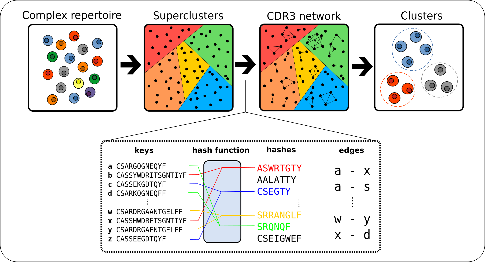

# ClusTCR: a Python interface for rapid clustering of large sets of CDR3 sequences with unknown antigen specificity [](https://travis-ci.com/svalkiers/clusTCR) [](https://anaconda.org/svalkiers/clustcr)

A two-step clustering approach that combines the speed of the [Faiss Clustering Library](https://github.com/facebookresearch/faiss) with the accuracy of [Markov Clustering Algorithm](https://micans.org/mcl/)

On a standard machine*, clusTCR can cluster **1 million CDR3 sequences in under 5 minutes**.  
<sub>*Intel(R) Core(TM) i7-10875H CPU @ 2.30GHz, using 8 CPUs</sub>

Compared to other state-of-the-art clustering algorithms ([GLIPH2](http://50.255.35.37:8080/),  [iSMART](https://github.com/s175573/iSMART) and [tcrdist](https://github.com/kmayerb/tcrdist3)), clusTCR shows comparable clustering quality, but provides a steep increase in speed and scalability.  

<p align="center">
  
</p>


## [Documentation](https://svalkiers.github.io/clusTCR/) & Install

All of our documentation, installation info and examples can be found in the above link!
To get you started, here's how to install clusTCR

```
$ conda install clustcr -c svalkiers -c bioconda -c pytorch -c conda-forge
```

There's also a GPU version available, with support for the `use_gpu` parameter in the `Clustering` interface.

```
$ conda install clustcr-gpu -c svalkiers -c bioconda -c pytorch -c conda-forge
```

Mind that this is for specific GPUs only, see our [docs](https://svalkiers.github.io/clusTCR/) for more information.

To **update** use a similar command
```
$ conda update clustcr -c svalkiers -c bioconda -c pytorch -c conda-forge
```

## Development Guide

#### Environment

To start developing, after cloning the repository, create the necessary environment

```
$ conda env create -f conda/env.yml
```

The requirements are slightly different for the GPU supported version

```
$ conda env create -f conda/env_gpu.yml
```

#### Building Packages

To build a new conda package, `conda build` is used.  
Mind that the correct channels (pytorch, bioconda & conda-forge) should be added first or be 
incorporated in the commands as can be seen in the install commands above.

```
$ conda build conda/clustcr/
```

For the GPU package:

```
$ conda build conda/clustcr-gpu/
```

## Cite

**Please cite as:**

Sebastiaan Valkiers, Max Van Houcke, Kris Laukens, Pieter Meysman, ClusTCR: a Python interface for rapid clustering of large sets of CDR3  sequences with unknown antigen specificity, *Bioinformatics*, **2021**;, btab446, https://doi.org/10.1093/bioinformatics/btab446

**Bibtex:**

```
@article{valkiers2021clustcr,
    author = {Valkiers, Sebastiaan and Van Houcke, Max and Laukens, Kris and Meysman, Pieter},
    title = "{ClusTCR: a Python interface for rapid clustering of large sets of CDR3 sequences with unknown antigen specificity}",
    journal = {Bioinformatics},
    year = {2021},
    month = {06},
    issn = {1367-4803},
    doi = {10.1093/bioinformatics/btab446},
    url = {https://doi.org/10.1093/bioinformatics/btab446},
    note = {btab446},
    eprint = {https://academic.oup.com/bioinformatics/advance-article-pdf/doi/10.1093/bioinformatics/btab446/38660282/btab446.pdf},
}
```

