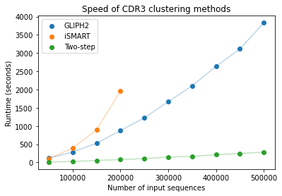

# clusTCR: a Python interface for rapid clustering of large sets of CDR3 sequences
clusTCR is a two-step clustering approach that combines the speed of the [faiss](https://github.com/facebookresearch/faiss) library with the accuracy of [Markov Clustering Algorithm](https://micans.org/mcl/). Compared to other state-of-the-art clustering algorithms ([GLIPH2](http://50.255.35.37:8080/) and [iSMART](https://github.com/s175573/iSMART)), clusTCR slightly underperforms in clustering quality, but provides a steep increase in speed and scalability. Using a standard laptop, clusTCR can cluster 2,000,000 sequences in a little over 30 minutes (Intel(R) Core(TM) i7-10875H CPU @ 2.30GHz).



## Installation
To install clusTCR, navigate to the folder in which you want to install the software and execute the following command:

```shell
git clone https://github.com/svalkiers/clusTCR
```

Next, you can directly install all the necessary dependencies by creating a new conda environment from the [env.yml](env.yml) file.

```shell
conda env create -f env.yml
```

Other dependencies have been integrated into the repository (under [src/modules/](src/modules)). Next, activate the new environment:

```shell
conda activate clusTCR
```

## Tutorial

> **_NOTE:_**  Change your working directory to the *src/* folder.

```python
import os
os.chdir(/home/<user>/<path_to_repo>/clusTCR/src/)
```

### Importing data sets

The current version of clusTCR supports two input formats: VDJdb and immuneACCESS. A recent version of all human TRB sequences exported from VDJdb is included in the [data/vdjdb/](data/vdjdb/) folder. Files exported from immuneACCESS should be stored under [data/immuneACCESS/](data/immuneACCESS/).

To import any set of data, you should add first add the data set folder to your `sys.path` variable:

```python
import sys
import os

# Add path to data sets to your sys.path variable, this allows you to import them
path = os.getcwd() + '/load_files/'
sys.path.insert(1, path)
```

Next, you can retrieve CDR3 sequences from the VDJdb by importing the following functions from the `datasets` module:

```python
from datasets import vdj_cdr3, vdj_cdr3_small

vdjdb_regular = vdj_cdr3() # pandas.Series of all human CDR3 beta in VDJdb
vdjdb_small = vdj_cdr3_small() # Subset of high quality entries
```

To import CDR3 sequences from an immuneACCESS file, perform the following sequence of code (make sure you added data folder to the `sys.path` variable):

```python
from datasets import immuneACCESS_cdr3
immuneaccess = immuneACCESS_cdr3() # pandas.Series of CDR3s in immuneACCESS file
```

The clusTCR platform also provides the functionality to construct a meta-repertoire from a list of immuneACCESS files. This functionality can be used to perform clustering on a number of samples, all at once. By default, clusTCR will search the [data/immuneACCESS/](data/immuneACCESS/) folder and starts randomly combining files until a desired threshold is met (e.g. 2,000,000 sequences).

```python
from datasets import metarepertoire_cdr3
meta_repertoire = metarepertoire_cdr3(n_sequences = 10**6) # pandas.Series containing 1M CDR3s
```

### Clustering

To perform clustering, import the `Clustering` module from `clusTCR`. A test set of CDR3 sequences is also provided within `clusTCR`, which will be used in this tutorial.

```python
from clusTCR import test_cdr3
cdr3 = test_cdr3()
```

The next step is to generate a `clusTCR.Clustering` object. The `Clustering` method takes two arguments:

1. A `pandas.Series` of CDR3 amino acid sequences.
2. The desired clustering method. Currently, `clusTCR` contains three clustering approaches: **MCL-based clustering, faiss-based clustering, and a two-step clustering** procedure which combines the first two methods for an increase in speed and accuracy. Valid options are: *mcl*, *faiss* or *two-step*. We recommend using *mcl* for data sets containing < 50,000 CDR3 sequences, and *two-step* for all data sets with > 50,000 sequences.

To perform the actual clustering, you will need to execute the `cluster_sequences()` method on the newly created object.

```python
from clusTCR import Clustering

clustering = Clustering(cdr3, method = 'two-step')
output = clustering.cluster_sequences()
```

### Evaluate output

If you have epitope data available, you can evaluate the quality of the clustering output using the `Metrics` module. Therefore, start by importing epitope data corresponding to the clustered CDR3 sequences. `clusTCR` contains a data set of epitope targets corresponding to the sequences used in the previous section. The epitope data should always have the following structure: **two tab-separated columns with headers `['CDR3', 'Epitope']`**.

```python
from clusTCR import test_epitope
epitope = test_epitope() # Epitope data corresponding to CDR3 sequences
```

Currently, `clusTCR` provides the following metrics for cluster evaluation:

- **Retention**: Fraction of sequences that is assigned to *any* cluster.
- **Purity**: Fraction of sequences within a cluster targeting the same epitope.
- **Consistency**: Fraction of sequences targeting the same epitope that are assigned to the same cluster.

```python
from clusTCR import Metrics

metrics = Metrics(output, epitope) # Provide clustering output and epitope data
retention = metrics.retention()
purity = metrics.purity()
consistency = metrics.consistency()
```

Printing these variables will show the resulting values for each metric. By default, the results are compared to the baseline. To generate this baseline, the cluster column of the clustering output is randomly permuted as to mimic a clustering algorithm that performs random clustering.

```python
print(retention)
0.2853333333333333

print(purity)
{'Actual': 0.8916464891041163, 'Permuted': 0.21337772397094432}

print(consistency)
{'Actual': 0.4064769975786925, 'Permuted': 0.06174334140435835}
```

### Cluster analysis

#### Features

`cluster_analyzer` contains additional modules for more advanced analysis of your clustering results. This module provides a functionality to calculate a set of features for each cluster. 13 features are calculated:

- **ic:** Average information content per amino acid position (ignoring C and F at the first and last position respectively) as determined by the Shannon entropy at each position. *ic* values are normalized for cluster size.
- **size:** Number of sequences in the cluster.
- **length:** Average length of CDR3 sequences in the cluster.
- **basicity_avg:** Average basicity in the cluster.
- **basicity_var:** Variance of basicity in the cluster.
- **hydrophobicity_avg:** Average hydrophobicity in the cluster.
- **hydrophobicity_var:** Variance of hydrophobicity in the cluster.
- **helicity_avg:** Average helicity in the cluster.
- **helicity_var:** Variance of helicity in the cluster.
- **mutation stability_avg:** Average mutation stability in the cluster.
- **mutation stability_var:** Variance of mutation stability in the cluster.
- **pgen_avg:** Average generation probability of CDR3 sequences in the cluster. Generation probability is calculated using the *olga* module.
- **pgen_var:** Variance of generation probability within the cluster.

These features can be calculated using the `FeatureGenerator` in the `cluster_analyzer`. The input provided should correspond to the output of the clustering procedure.

```python
from cluster_analyzer import FeatureGenerator
feature_generator = FeatureGenerator(results)
features = feature_generator.get_features()
```

**NOTE:** calculating generation probabilities is time-consuming. You will receive a warning asking you whether you want to proceed.

```
Calculating generation probabilities may take a while. Are you sure you want to continue?

Confirm: [Y/N] 
```

If you select `N` the algorithm will generate a feature matrix nevertheless. However, keep in mind that this matrix will not contain values for *pgen_avg* and *pgen_var*.

#### PCA

To get a quick overview of the newly generated features, the `cluster_analyzer` contains a built-in PCA functionality.

```python
feature_generator.perform_PCA(features)
```


The PCA plot is saved under [figures](results/figures/) in the results folder.

#### Analyzing quality of clusters without known epitopes

An additional feature of the `cluster_analyzer` is predicting the quality of a cluster. Here, quality is determined as the **purity** of a cluster. This feature is particularly useful when no information is available about the target epitopes of the clustered TCR sequences.

##### Predicting clustering quality

Using the `QualityPredict` module, you can use a pre-trained model to predict clustering quality based on a matrix containing cluster features. Alternatively, you can use your own classification model to make predictions. The `cluster_analyzer` also provides a way to train your own models (see later).

```python
from cluster_analyzer import QualityPredict
quality_prediction = QualityPredict(features)

# Use pre-trained model
prediction = quality_prediction.predict_clustering_quality()

# Use custom model
prediction = quality_prediction.predict_clustering_quality(model = my_classifier)
```

##### Training your own model

You can also train your own model using the `ModelTraining` module. To do this, you will need to provide the following three arguments: features (calculated from the `FeatureGenerator`), results from the clustering and epitope data corresponding to the CDR3 sequences used for clustering.

```python
from cluster_analyzer import ModelTraining
model_training = ModelTraining(features, results, epitope)

# Train your own model
classifier = model_training.train_model()
```

You can evaluate your own model using the `.evaluate_model()` function. This will perform 10-fold stratified cross-validation and outputs a receiver operating characteristic (ROC) curve with corresponding area under the curve (AUC) value.

```python
# Evaluate your own model
model_training.evaluate_model()
```


