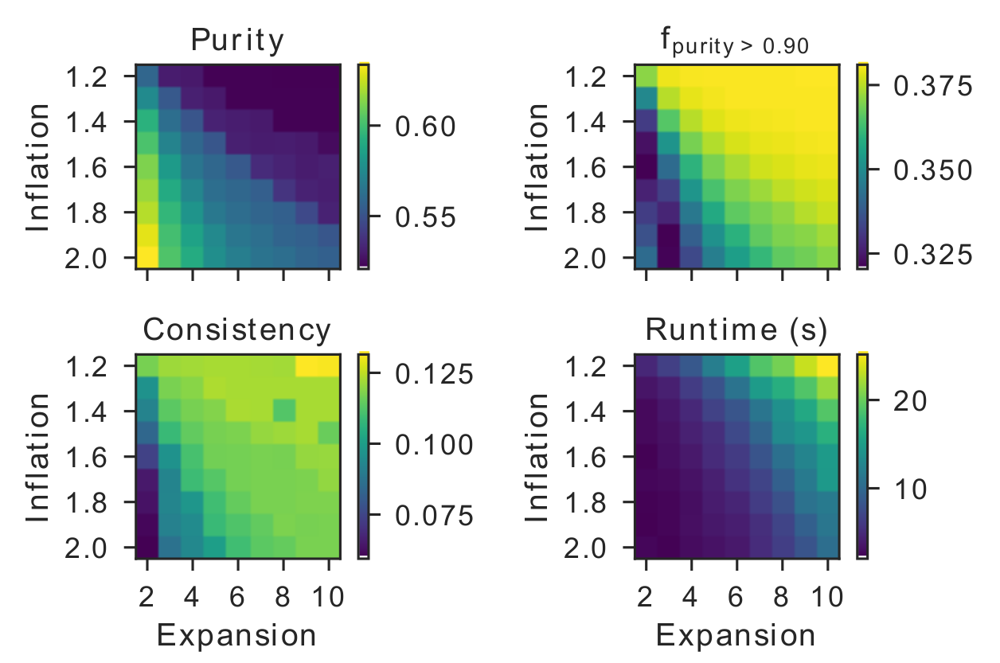

##  Optimizing the second clustering step

The ClusTCR clustering procedure can be further optimized to the user's needs by customizing the second clustering step. During this second step, ClusTCR looks for pairs of sequences that have a **Hamming distance (HD) of <= 1** within each supercluster. From this list of paired sequences, a **graph** is built, which is subsequently clustered using the Markov clustering algorithm (MCL). This method involved a random walk, determined by the probability value dictated by a series of Markov chains. The algorithm simulates stochastic flow and identifies densely interconnected regions in the graph where flow is high. The stochastic matrix, from which the probabilities are determined, is manipulated in two ways:

1. Raising the stochastic matrix to the power *i*. This determines the length of the path that can be detected. In other words, it determines the amount of flow between different regions of the graph. This process is known as **expansion**.
2. Raising entries in one column to the power *j* and rescaling them so that the column sums up to 1. This way, the values represent probabilities, which is necessary for calculating the random walk. This process is known as **inflation**.

In ClusTCR, you can specify the values for both expansion and inflation, offering even more flexibility. 

```python
expansion = 2
inflation = 3
clustering = Clustering(mcl_params=[expansion,inflation])
```

This way, the user can make the clustering more or less stringent. For example, increasing the expansion parameter will allow more flow between different regions of the graph. As a result, clusters will be larger on average, but the time to complete the process will take longer. Conversely, increasing the inflation parameter will increase the transition probabilities between strong neighbors and decrease the transition probabilities between weak neighbors. This will restrict flow between weak neighbors, ultimately resulting in smaller clusters on average, but requiring less computation time. These statements are nicely illustrated in the figure below.

<p align="center" style="margin-top: 10px">
  
</p> 
Let's illustrate this with an example. Here we will choose 3 distinct configurations where we let one of the MCL hyperparameters vary. We then evaluate the influence of these parameters as illustrated by the runtime of the algorithm and the average number of sequences within a cluster.

```python
from clustcr import datasets, Clustering
import time

data = datasets.vdjdb_beta()

# MCL params - example 1
inflation = 2
expansion = 2
t = time.time()
c_1 = Clustering(mcl_params=[inflation, expansion]).fit(data)
t_1 = round(time.time() - t, 2)
avg_cluster_size_1 = round(len(c_1.clusters_df) / len(c_1.clusters_df.cluster.unique()),2)

# MCL params - example 2
inflation = 2
expansion = 5
t = time.time()
c_2 = Clustering(mcl_params=[inflation, expansion]).fit(data)
t_2 = round(time.time() - t, 2)
avg_cluster_size_2 = round(len(c_2.clusters_df) / len(c_2.clusters_df.cluster.unique()), 2)

# MCL params - example 3
inflation = 5
expansion = 2
t = time.time()
c_3 = Clustering(mcl_params=[inflation, expansion]).fit(data)
t_3 = round(time.time() - t, 2)
avg_cluster_size_3 = round(len(c_3.clusters_df) / len(c_3.clusters_df.cluster.unique()), 2)

print('Configuration 1 - time: %s seconds; average sequences per cluster: %s ' % (t_1, avg_cluster_size_1), f'\n',
      'Configuration 2 - time: %s seconds; average sequences per cluster: %s ' % (t_2, avg_cluster_size_2), f'\n',
      'Configuration 3 - time: %s seconds; average sequences per cluster: %s ' % (t_3, avg_cluster_size_3)
     )
```

```
> Configuration 1 - time: 5.25 seconds; average sequences per cluster: 3.25  
> Configuration 2 - time: 6.04 seconds; average sequences per cluster: 5.1  
> Configuration 3 - time: 4.77 seconds; average sequences per cluster: 2.06  
```
