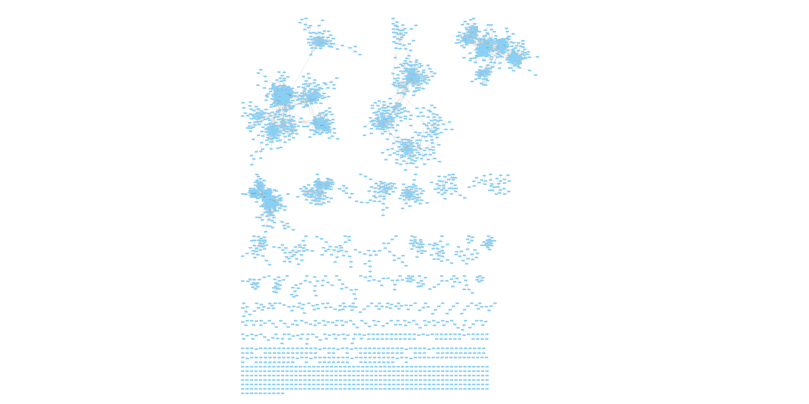
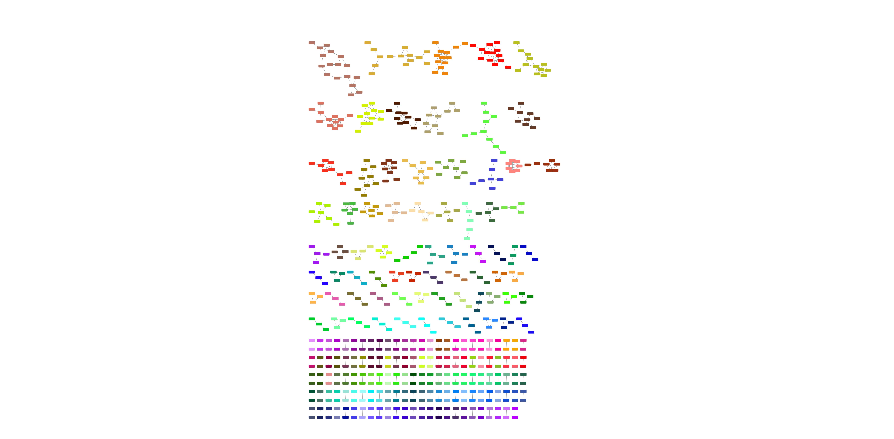

## Visualization

Visualization of immune repertoires can be a daunting task. Here we provide a brief tutorial of how ClusTCR's output can be used to visualize your data in **[Cytoscape](https://cytoscape.org/)**. Unfortunately, due to memory-related limitations, Cytoscape can only handle repertoires of limited size.

This tutorial assumes that you have already installed Cytoscape on your device. If this is not the case, you can find the appropriate download for you OS via this link: [https://cytoscape.org/download.html](https://cytoscape.org/download.html).

### 1. Creating the edge and node lists

The first step in visualizing your clustering results is creating the appropriate Cytoscape input files. These consist of one edge list (containing all pairs of sequences between which an edge must be drawn) and a node list (containing a data frame of all nodes with some annotation, such as the clusters they belong to).

You can retrieve the edge list from a `ClusteringResult` object, by applying the `export_network()` method on it. This method take a *filename* parameter, for which you can specify the name and location where the edge list should be exported to. If no file name is provided, ClusTCR will save the edge list in a file with a generic name (*clusTCR_network.txt*) in your current working directory. The edge list is saved as a tab-separated text file of all CDR3 amino acid sequence pairs that have an **exact edit-distance** (Hamming distance) **of 1**.

```python
edges = output.export_network(filename='/home/path_to_output/my_clustcr_edgelist.txt')
```

The node list simply corresponds to the `clusters_df` output. Simply save this result by applying the `write_to_csv()` method on a `ClusteringResult` object.

```python
output.write_to_csv(filename='/home/path_to_output/my_clustcr_nodelist.txt')
```

### 2. Importing the data in Cytoscape

#### 2.1. Creating a network visualization

Open Cytoscape and start by importing the network from the edge list you just created. Click on *File > Import > Network from File...* or use the keyboard shortcut *CTRL + L*. Select the edge list you want to import and click *Open*. Next, click on *Advanced Options...* and make sure you **do not** use the first line as column names. Assign one column as source and one as target node (it does not matter which column is source and which is target). If desired, you can also change the names of the columns. Now click *OK* to create a visualization of your network. Without any annotation, it will look something like this:

<p align="center">
    
</p>
#### 2.2. Adding cluster annotations

The next step is annotating the network with the IDs of the identified clusters. To do this, we need to import the node list, which contains all the CDR3 sequences in the network along with their corresponding cluster IDs assigned to them. Import the table by selecting *File > Import > Table from File...* and choose the appropriate delimiter in the *Advanced Options...* menu. Then click *OK* to import the table.

To visualize the clusters in the network, you can color each node according to its assigned cluster ID. Go to *Style* and select the *Mapping* function of the *Fill Color* property. Then choose the *cluster* column to map onto the network. Select *Discrete Mapping* and then right-click on *Fill Color* to select one of the *Mapping Value Generators*.

<p align="center">
    
</p>

