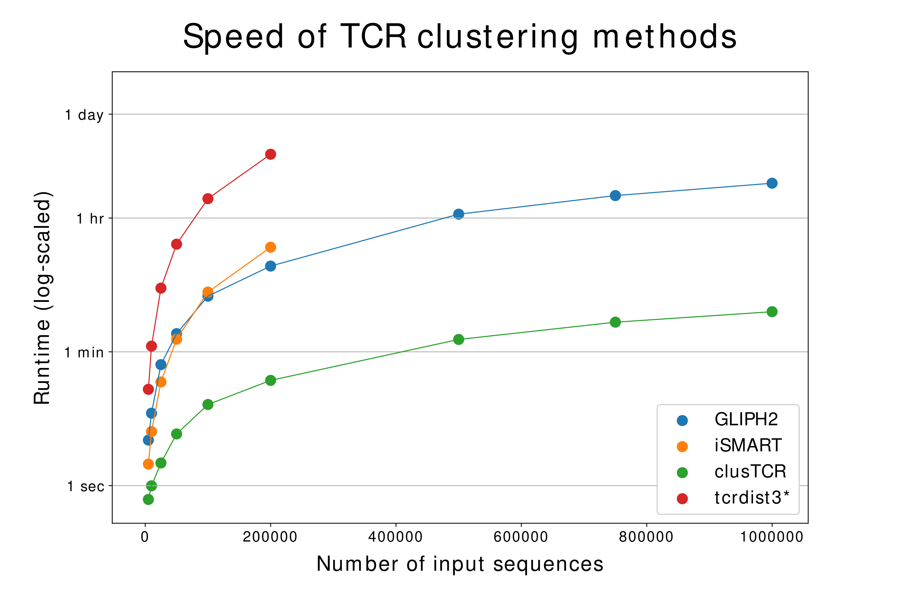

## Why should I use clusTCR?

clusTCR offers a 50x speed improvement (at 10**6 sequences) over GLIPH2, the second fastest TCR/CDR3 clustering available. At the same time, the clustering quality of clusTCR remains comparable to other approaches. Benchmarking revealed that clusTCR can cluster one million CDR3 sequences in less than 5 minutes.

  

