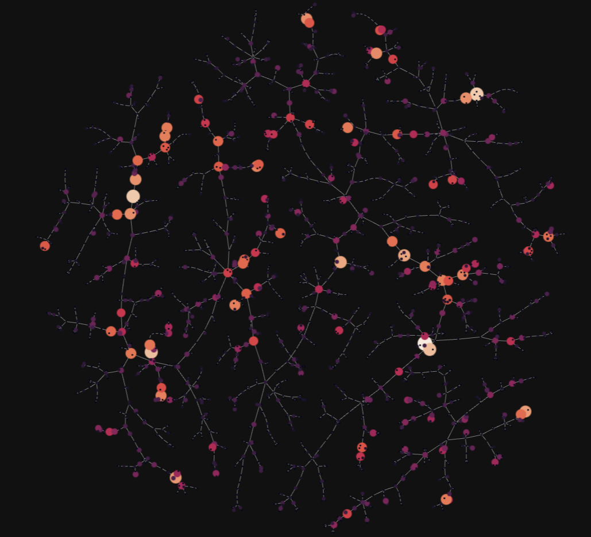
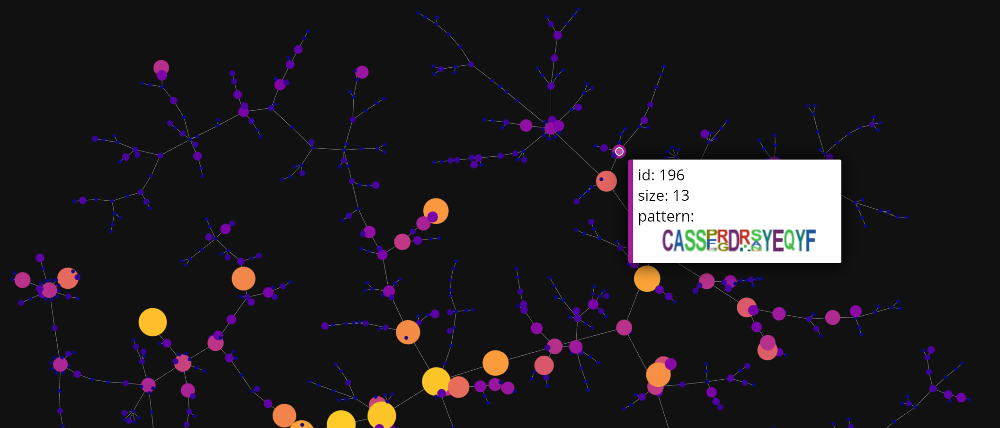

## Visualization (coming soon)

Visualization is a crucial step while exploring TCR repertoires. However, given the vast size and complexity of individual TCR profiles, only small portions of the repertoire may be visualized. ClusTCR's visualization features provide a summarized representation of the TCR repertoire, by condensing individual TCRs into clusters of approximate sequence similarity. In addition, the visualization provides interactive features for exploring the characteristics of the clusters. The visualization is a graph representation of the TCR repertoire, where every node represents a cluster. The graph is created by calculating the minimum spanning tree of the distances between clusters. Consequently, an edge is drawn from one cluster to its nearest neighbor.

Start by importing the `as_cluster_graph` function from the visualization module. This function requires a `ClusteringResult` object as input. 

```python
from clustcr import Clustering
from clustcr.visualization import as_cluster_graph
# Cluster your TCR data
res = Clustering().fit(tcrs)
# Use clustering output as input for the visualization function
as_cluster_graph(res)
```

The visualization will look something like this:

<p align="center">
    
</p>


```python
as_cluster_graph(
    clusters = res,
    show_motif_logos = True
  	second_pass_metric = "tfidf_cosine"
	)
```

<p align="center">
    
</p>


You can also adjust the color of the background using the `background_color` parameter. This argument only permits *black* or *white*. By default, the dark background will be used. When set to *white*, the function will create a light version of the figure.

```python
as_cluster_graph(
    clusters = res,
    background_color = "white"
	)
```

