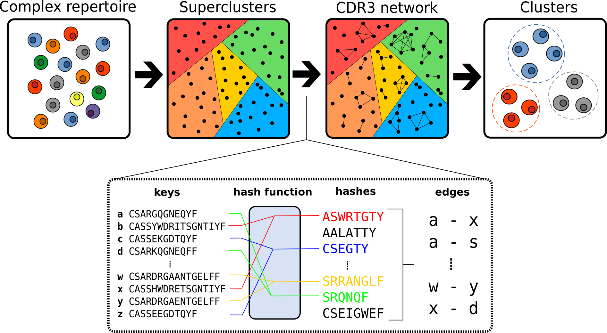

# clusTCR: a Python interface for rapid clustering of large sets of CDR3 sequences

A two-step clustering approach that combines the speed of the [Faiss Clustering Library](https://github.com/facebookresearch/faiss) with the accuracy of [Markov Clustering Algorithm](https://micans.org/mcl/)
{: .fs-5 .fw-300 }

On a standard machine*, clusTCR can cluster **1 million CDR3 sequences in under 5 minutes**.  
<sub>*Intel(R) Core(TM) i7-10875H CPU @ 2.30GHz, using 8 CPUs</sub>

Compared to other state-of-the-art clustering algorithms ([GLIPH2](http://50.255.35.37:8080/),  [iSMART](https://github.com/s175573/iSMART) and [tcrdist](https://github.com/kmayerb/tcrdist3)), clusTCR shows comparable clustering quality, but provides a steep increase in speed and scalability.  


<p align="center" style="margin-top: 30px">
  
</p>


## Getting started

To install clusTCR on Linux or OSX, simply use conda.

```
conda install clustcr -c svalkiers -c bioconda -c pytorch -c conda-forge
```

A GPU version is also available (only for CUDA enabled GPUs on Linux), with support for the `use_gpu` parameter in the `Clustering` interface.

```
conda install clustcr-gpu cudatoolkit=VERSION -c svalkiers -c bioconda -c pytorch -c conda-forge
```

with the cudatoolkit version being

- 8.0 for CUDA8
- 9.0 for CUDA9
- 10.0 for CUDA10

To read more about the GPU support, visit the [Faiss GPU page](https://github.com/facebookresearch/faiss/wiki/Faiss-on-the-GPU).
